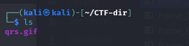
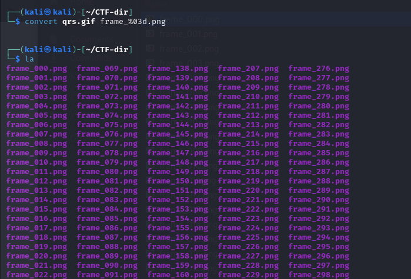
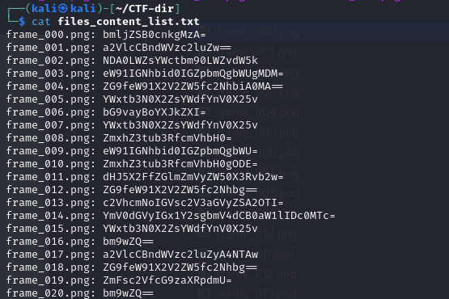
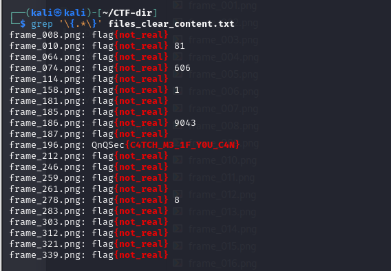

# QnQSec CTF 2025 – Catch Me

### Category: Forensics

This Forensics challenge was launched by [QnQSec](https://ctftime.org/event/2826/) in **October 2025**. The task focused on analyzing a **.gif** file to uncover hidden data. Using tools such as **ImageMagick’s `convert`** and custom **Python scripting**, I extracted and interpreted the concealed information — demonstrating key skills in **digital forensics** and **data recovery**.

---

## Practical Command Usage

First, I analyzed the metadata of the provided GIF file.

<p align="center">
  
</p>

Next, I extracted all the frames from the `.gif` file.

<p align="center">
  
</p>

Each frame turned out to be a **QR code**.
To automate the extraction and decoding of the QR data, I created the following Python script:

```bash
cat script_xtract_png_content.py
```

```python
import cv2
import os
from pyzbar.pyzbar import decode

for file in os.listdir("."):
    img = cv2.imread(f"{file}")
    for qr in decode(img):
        print(f"{file}: {qr.data.decode()}")
```

<p align="center">
  
</p>

Each QR code contained **Base64-encoded text**, so I wrote another script to **decode** the Base64 strings into readable ASCII or hexadecimal data:

```bash
cat script_decyt_base64.py
```

```python
import base64

# Input file containing lines like:
# frame_000.png: bmljZSB0cnkgMzA=
input_file = "file.txt"

with open(input_file, "r") as f:
    for line in f:
        if ":" not in line:
            continue
        frame, encoded = line.strip().split(": ", 1)
        try:
            decoded = base64.b64decode(encoded).decode("utf-8")
        except Exception as e:
            decoded = f"[ERROR decoding] {e}"
        print(f"{frame}: {decoded}")
```

Here’s the decoded result:

<p align="center">
  
</p>

---

