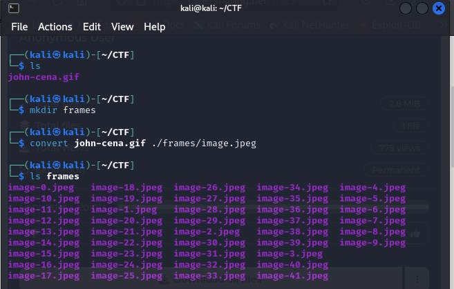
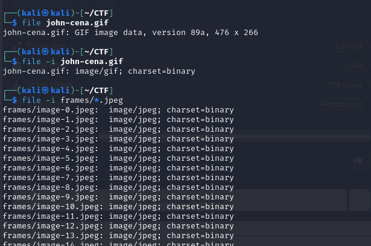
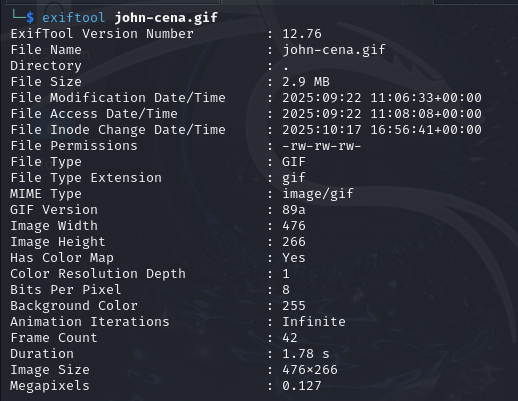
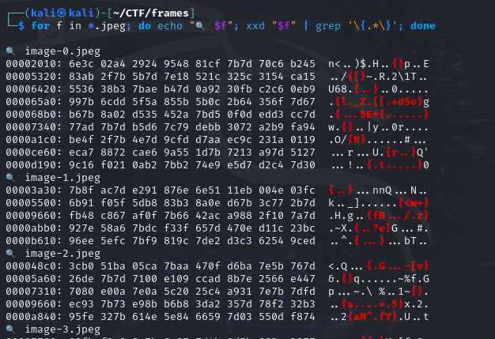
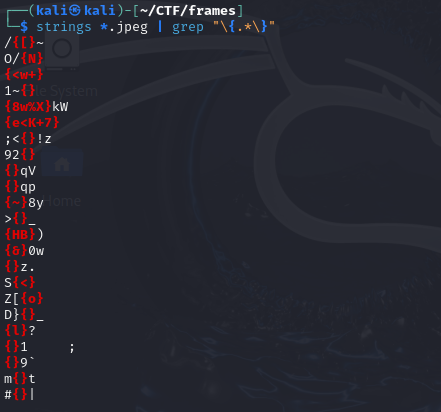

# QnQSec CTF 2025 - John Cena

# Intro (Forensics - CTF):

This Forensics challenge was launched by [QnQsec](https://ctftime.org/event/2826/) in October 2025. The task centers on analyzing a .gif file for hidden data. i used tools such as **convert**, **file**, **Exiftool**, **xxd**, **strings**, and **binwalk** to extract and interpret concealed information, demonstrating core skills in digital investigation.

## Practical Command Usage
First, we need to convert the .gif file into multiple .jpeg files so that we can handle each frame individually.

<p><align="center">
  
</p>

### Detect the actual file type (not just the extension)

- The command-line tool `file` is commonly used to **display the MIME type of a file**.
- This helps understand file formats for cybersecurity analysis, for example:
  - **text/plain:** plain text file
  - **image/png:** PNG image file
  - **application/pdf:** PDF document
  - **application/zip:** ZIP compressed archive

<p><align="center">
  
</p>

charset=binary
Indicates that the file’s content is not text-based and cannot be interpreted using a character encoding like UTF-8 or ASCII. Instead, it’s pure binary data.

### deep dive in .gif file metadata 

<p><align="center">
  
</p>

File Type & MIME:
GIF with MIME type image/gif. This confirms it’s a GIF image, not a disguised file.

File Size:
2.9 MB — relatively large for a GIF, which suggests it might contain many frames or hidden data.

GIF Version:
89a — standard GIF format.

Dimensions:
476 x 266 pixels, with 0.127 Megapixels.

Frame Count:
42 frames — this is important. A GIF with many frames often indicates potential for hidden clues across frames (common in CTF challenges).

### file embedded text 
Flags in CTF challenges often follow a format like FLAG{something} or AKASEC{part1_part2_part3}.
JPEG frames might contain hidden text embedded in the binary data (not visible in the image).
This step quickly scans all frames for potential flag fragments without manually opening each image.

```bash
for f in *.jpeg; do echo "$f"; xxd "$f" | grep '{.*}'; done
```
<p><align="center">
  
</p>

Red-highlighted ASCII parts show suspicious characters like {, }, and letters.
This suggests flag fragments are embedded in the JPEG binary, confirming the GIF was hiding data across frames.

 extracts all printable ASCII text from binary files
<p>
<align="center">
  
</p>

## Next Steps

Save all fragments in order (based on frame sequence).
Concatenate them to form the complete flag.
Validate against the expected format (AKASEC{...}).