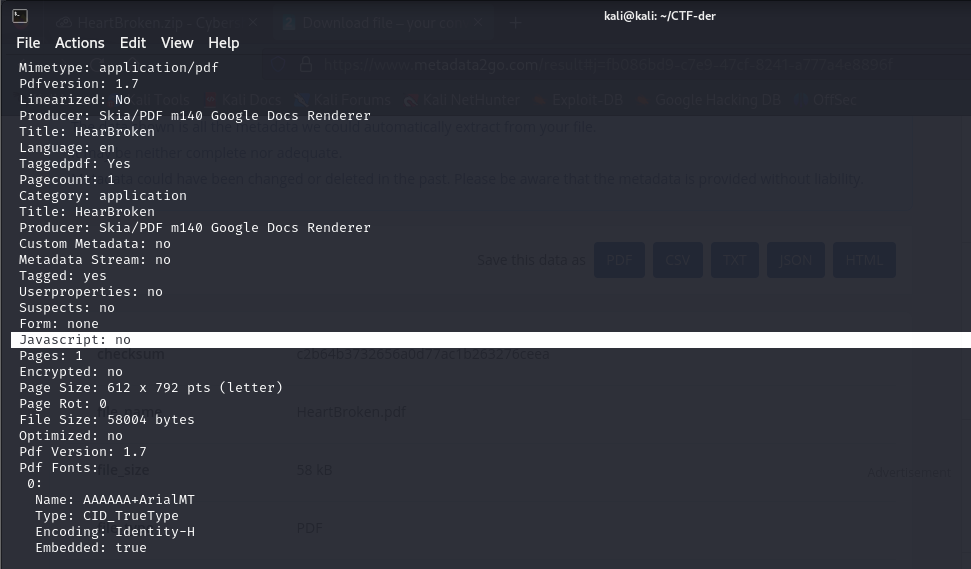
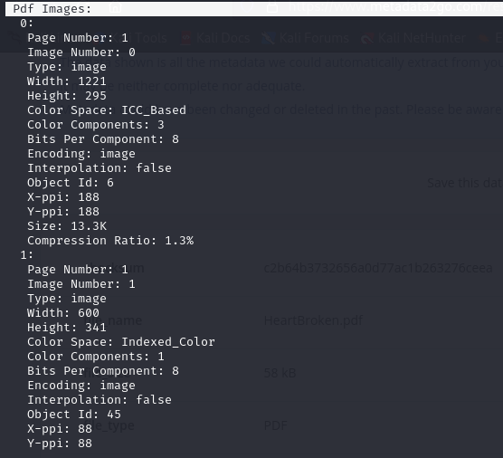
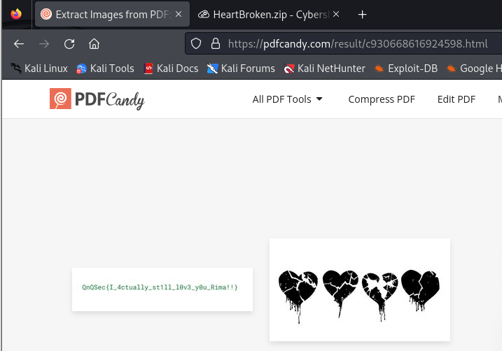

# QnQSec CTF 2025 - HeartBroken

# Intro (Forensics - CTF):

This Forensics challenge was launched by QnQsec in October 2025. The task centers on analyzing a .pdf file for hidden data. i used tools such as **pdfimages** and platform such as **PdfCandy**  to extract and hidden images, demonstrating core skills in digital investigation.

## Why Metadata Analysis Matters
Checking PDF metadata reveals hidden elements that normal viewing does not show. In this challenge:
- No JavaScript → no script-based tricks.
- Two embedded images → only one visible initially.
This indicates the need to extract hidden resources, which led us to the flag.
``

## Practical Command Usage
First, we need to analyse the metadata of the pdf file

<align="center">
  

We observe that no javascript code are embeded in the pdf file.

<align="center">
  

but we see that two images are included in it . but when we opened tha file we only see one image .

## Extract the hidden image

<align="center">
  

so now the hidden image appered clearely and it contaned the flag.

