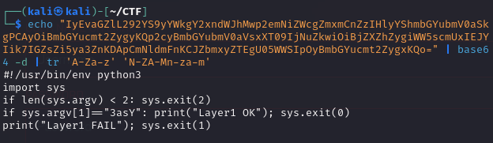
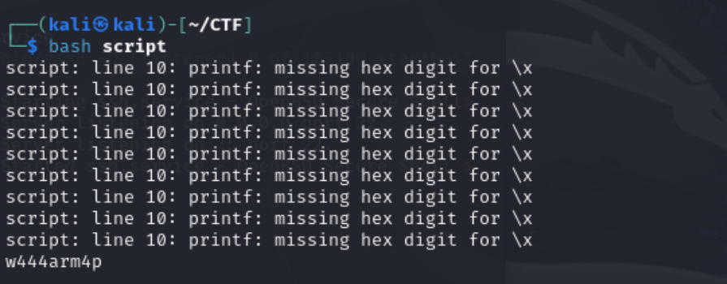
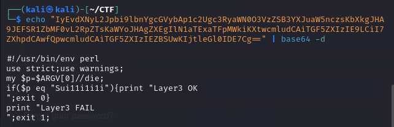
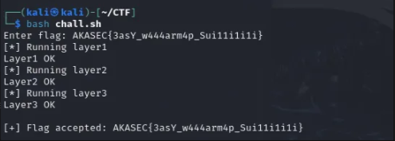

# Intro
The AKASEC Club’s October 2025 CTF challenge, under the reverse engineering category, presented a multi-layered script incorporating Python, Bash, and Perl. With a reward of 50 points, the objective was to analyze the code, decode embedded clues, and reconstruct the flag in the format AKASEC{part1_part2_part3}. This write-up details the approach and steps taken to solve the challenge.

## Context
We were given a script with three embedded, base64-encoded payloads (Python, Bash, Perl) and an input flag with the format AKASEC{part1_part2_part3}. The challenge consisted in reconstructing the flag through analysis and code reversing.

---

## Challenge Overview
### Given: 

```bash
cat chall.sh  
```

```bash           
#!/usr/bin/env bash
PY_ENC='IyEvaGZlL292YS9yYWkgY2xndWJhMwp2emNiZWcgZmxmCnZzIHlyYShmbGYubmV0aSkgPCAyOiBmbGYucmt2ZygyKQp2cyBmbGYubmV0aVsxXT09IjNuZkwiOiBjZXZhZygiWW5scmUxIEJYIik7IGZsZi5ya3ZnKDApCmNldmFnKCJZbmxyZTEgU05WWSIpOyBmbGYucmt2ZygxKQo='
BASH_ENC='IyEvdXNyL2Jpbi9lbnYgYmFzaApwPSIkMSIKaWYgWyAteiAiJHAiIF07IHRoZW4gZXhpdCAyOyBmaQprZXk9MHgyMwpvdXQ9IiIKZm9yICgoaT0wO2k8JHsjcH07aSsrKSk7IGRvCiAgYz0iJHtwOmk6MX0iCiAgb3JkPSQocHJpbnRmICIlZCIgIickYyIpCiAgeD0kKCggb3JkIF4ga2V5ICkpCiAgb3V0Kz0kKHByaW50ZiAiJTAyeCIgJHgpCmRvbmUKaWYgWyAiJG91dCIgPSAiNTQxNzE3MTc0MjUxNGUxNzUzIiBdOyB0aGVuCiAgZWNobyAiTGF5ZXIyIE9LIjsgZXhpdCAwCmVsc2UKICBlY2hvICJMYXllcjIgRkFJTCI7IGV4aXQgMQpmaQ=='
PERL_ENC='IyEvdXNyL2Jpbi9lbnYgcGVybAp1c2Ugc3RyaWN0O3VzZSB3YXJuaW5nczsKbXkgJHA9JEFSR1ZbMF0vL2RpZTsKaWYoJHAgZXEgIlN1aTExaTFpMWkiKXtwcmludCAiTGF5ZXIzIE9LCiI7ZXhpdCAwfQpwcmludCAiTGF5ZXIzIEZBSUwKIjtleGl0IDE7Cg=='


FLAG_IN="${1:-}"
if [ -z "$FLAG_IN" ]; then
  read -r -p "Enter flag: " FLAG_IN
fi

if [[ ! "$FLAG_IN" =~ ^AKASEC\{.+\}$ ]]; then
  echo "Bad format. Use AKASEC{part1_part2_part3}"
  exit 1
fi

inner="${FLAG_IN#AKASEC{}"
inner="${inner%}}"
IFS='_' read -r p1 p2 p3 <<< "${FLAG_IN:7:-1}"

TMPDIR=$(mktemp -d)
trap 'rm -rf "$TMPDIR"' EXIT

# Decode layers
base64 -d <<<"$PY_ENC" | tr 'A-Za-z' 'N-ZA-Mn-za-m' > "$TMPDIR/layer1.py"
base64 -d <<<"$BASH_ENC" > "$TMPDIR/layer2.sh"
base64 -d <<<"$PERL_ENC" > "$TMPDIR/layer3.pl"
chmod +x "$TMPDIR"/*

echo "[*] Running layer1"
python3 "$TMPDIR/layer1.py" "$p1" || exit 1
echo "[*] Running layer2"
bash "$TMPDIR/layer2.sh" "$p2" || exit 1
echo "[*] Running layer3"
perl "$TMPDIR/layer3.pl" "$p3" || exit 1

echo
echo "[+] Flag accepted: $FLAG_IN"

```

A Bash script with several embedded, base64-encoded payloads for Python, Bash, and Perl.

The flag format is AKASEC{part1_part2_part3}.

Provided encoded data:

**PY_ENC**, **BASH_ENC**, **PERL_ENC**

Several hints, including encoded strings and a Bash decoding routine.

## Step-by-step Solution

### 1. Script Analysis
The main script verifies the input format: `AKASEC{part1_part2_part3}`.

Three layers must be validated:

- **Layer 1:** Python (checks part 1)
- **Layer 2:** Bash (checks part 2)
- **Layer 3:** Perl (checks part 3)

---

### 2. Extract of hints and Decode Payloads

### -**Layer 1:** 
<p align="center">
  
</p>

→ 3asY (FLAG-Part1)

### -**Layer 2:** 

### Extraction
<p align="center">
  
</p>

→ 5417171742514e1753 

### Decoding the Second Part
```bash
cat script  
``` 

```bash
#!/usr/bin/env bash
target="5417171742514e1753"
key=0x23
decoded=""

for ((i=0; i<${#target}; i+=2)); do
  hex="${target:i:2}"
  dec=$((0x$hex))
  orig=$((dec ^ key))
  decoded+=$(printf "\\x%02x" $orig)
done

echo -e "$decoded"
```
<p align="center">
  
</p>

This outputs: → w444arm4p  (FLAG-Part2)

<p align="center">
  
</p>

→ Sui11i1i1i (FLAG-Part3)

--- 

### Final Answer
AKASEC{3asY_w444arm4p_Sui11i1i1i}

<p align="center">
  
</p>

---

## Summary Table:

| Part | Value        | Method          |
|------|-------------|-----------------|
| 1    | 3asY        | Direct hint     |
| 2    | w444arm4p   | Hex/XOR decode  |
| 3    | Sui11i1i1i  | Direct hint     |

